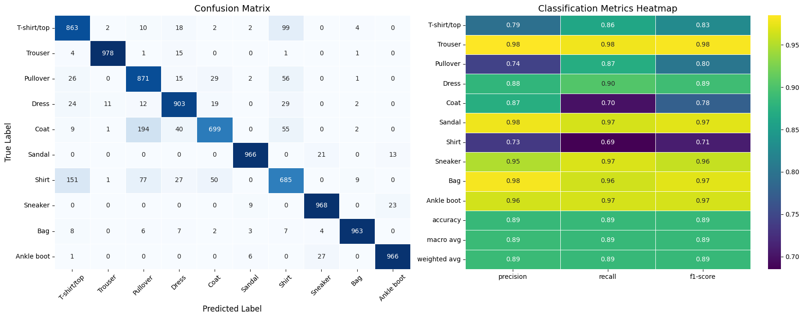
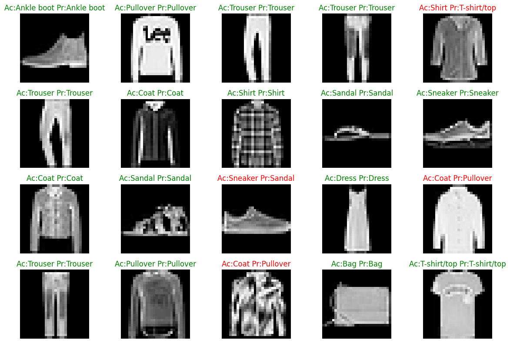

# Fashion MNIST Neural Network Classifier

A deep learning project using TensorFlow/Keras to classify clothing items from the **Fashion MNIST** dataset.

## Dataset Overview

The Fashion MNIST dataset contains **70,000 grayscale images** (28x28 pixels) across 10 classes:

| Class ID | Label | Class ID | Label |
| :--- | :--- | :--- | :--- |
| **0** | T-shirt/top | **5** | Sandal |
| **1** | Trouser | **6** | Shirt |
| **2** | Pullover | **7** | Sneaker |
| **3** | Dress | **8** | Bag |
| **4** | Coat | **9** | Ankle boot |

---

## Model Evaluation & Confusion Matrix

The model's classification performance across all 10 categories:

### Key Insights
* High precision on distinct items like **Trousers**, **Bags**, and **Ankle boots**.
* Minor class overlap observed between similar upper-body silhouettes (**Shirt**, **T-shirt/top**, and **Pullover**).

---

## Sample Predictions

Visual verification of test sample predictions alongside ground truth labels:

---

