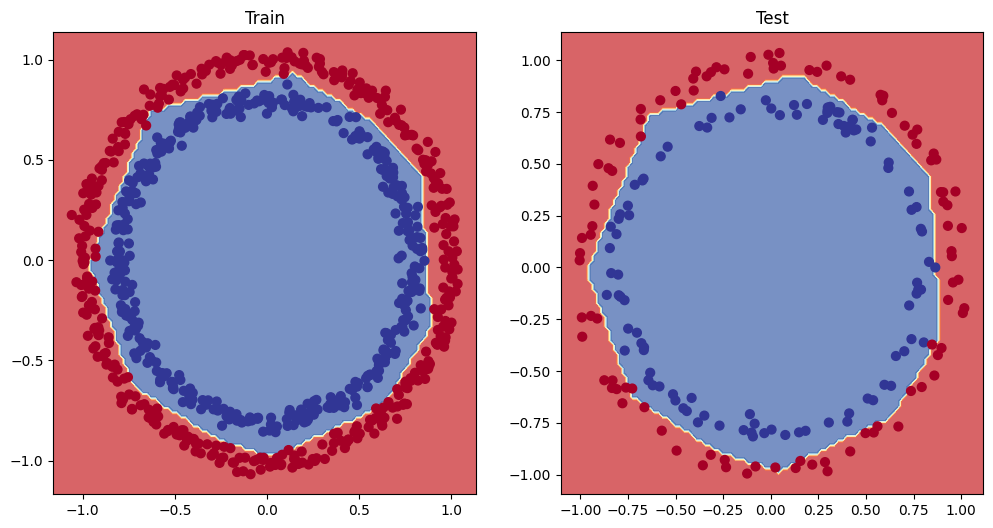
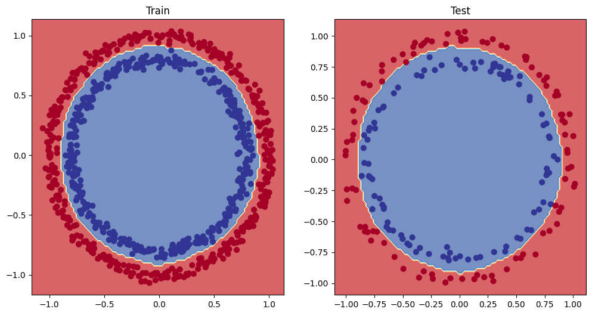

# Non-Linear Classification with TensorFlow: Make Circles

A deep learning project built with **TensorFlow** and **Scikit-Learn** to classify a non-linear toy dataset (`make_circles`), optimize training dynamics using a learning rate scheduler, and visualize the evolving decision boundaries.

## Features
* **Dataset Generation:** Uses `sklearn.datasets.make_circles` to create a synthetic binary classification problem with concentric circles.
* **Neural Network Architecture:** Custom multi-layer perceptron (MLP) built with TensorFlow/Keras capable of handling non-linear data patterns.
* **Learning Rate Optimization:** Implements an LR scheduler to dynamically adjust step sizes, preventing stagnation and fine-tuning convergence.
* **Visualization:** Plots scatter plots of the dataset and custom decision boundaries using `Matplotlib`.

---

## Impact of the Learning Rate Scheduler

Using a learning rate scheduler helps the model adapt its step size during training, allowing it to escape stagnant local minima and precisely fit the non-linear circular boundary.

<table>
  <tr>
    <td align="center"><b>Before LR Scheduler</b> <i>(Standard/Constant LR - Stagnant boundary)</i></td>
    <td align="center"><b>After LR Scheduler</b> <i>(Optimized/Decayed LR - Clean decision boundary)</i></td>
  </tr>
  <tr>
    <td></td>
    <td></td>
  </tr>
</table>

### Key Observations:
* **Before:** The model struggles to separate the concentric circles cleanly, leading to rough or incomplete decision paths.
* **After:** As the learning rate decays, the optimizer fine-tunes the weights smoothly, resulting in a sharp and accurate circular decision boundary.
